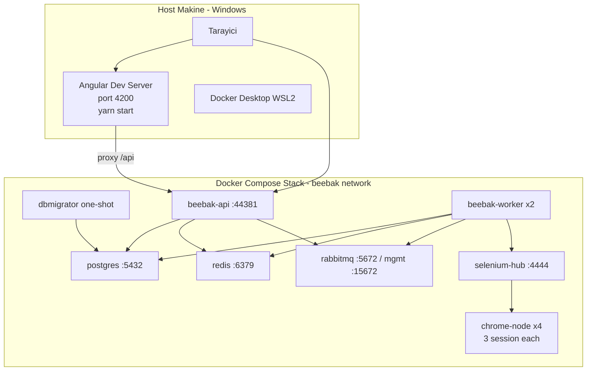

# BeeBAK — Yeni Bilgisayarda Kurulum & Günlük Başlatma Rehberi

Yeni bir Windows makinede BeeBAK projesini sıfırdan ayağa kaldırmak ve her bilgisayar açılışında sistemi başlatmak için adım adım komutlar.

> Mevcut çalışma modeli: Backend stack (Postgres, Redis, RabbitMQ, Selenium Hub + 4 Chrome node, DbMigrator, API, 2 Worker) tamamen Docker Compose'da; Angular dev server host makinede `yarn start` ile çalışır.

## Mimari



---

## A) Yeni Bilgisayara İlk Kurulum (Bir kez)

Tüm komutlar **PowerShell 7 (yönetici)** penceresinde çalıştırılır.

### A.1 Sistem önkoşulları (winget ile)

```powershell
winget install --id Microsoft.PowerShell -e --accept-source-agreements --accept-package-agreements
winget install --id Docker.DockerDesktop -e --accept-source-agreements --accept-package-agreements
winget install --id OpenJS.NodeJS.LTS -e --accept-source-agreements --accept-package-agreements
winget install --id Git.Git -e --accept-source-agreements --accept-package-agreements

# Opsiyonel ama tavsiye: lokal build / EF migrations için .NET 10 SDK preview
winget install --id Microsoft.DotNet.SDK.Preview -e --accept-source-agreements --accept-package-agreements
```

> Windows yeniden başlatma isteyebilir, yap. Docker Desktop ilk açılışta WSL2 backend kurulumunu tamamlamalı; tray ikonu yeşil ("Engine running") yanmalı.

### A.2 Yarn'ı etkinleştir (Node 22 ile gelen corepack üzerinden)

```powershell
corepack enable
corepack prepare yarn@stable --activate
yarn --version  # doğrulama
```

### A.3 Repo'yu klonla

```powershell
$repoRoot = "C:\Users\$env:USERNAME\source\repos\BeeBAK"
New-Item -ItemType Directory -Force $repoRoot | Out-Null
cd $repoRoot
git clone <REPO_URL> BeeBAK
cd BeeBAK
```

### A.4 Angular bağımlılıkları (host'ta, bir kez)

```powershell
cd angular
yarn install
cd ..
```

### A.5 Backend stack'i build + DB schema + servisleri ayağa kaldır

```powershell
# Docker Desktop çalışıyor olmalı (tray ikonu yeşil)
# İlk build ağır sürer (5-15 dk); SDK image'ları indirilir.
docker compose build

# Servisleri arka planda aç. dbmigrator otomatik çalışır, api ona bağımlı.
docker compose up -d

# Sağlık kontrolü (api dahil hepsi healthy olmalı)
docker compose ps
```

DbMigrator schema'yı oluşturup admin kullanıcı (`admin` / `1q2w3E*`) ile seed yapar.

### A.6 Angular dev server (ayrı bir PowerShell penceresinde)

```powershell
cd C:\Users\$env:USERNAME\source\repos\BeeBAK\BeeBAK\angular
yarn start
# http://localhost:4200 açılır, ilk derleme ~30-60 sn
```

---

## B) Her Bilgisayar Açılışında Sistemi Ayağa Kaldırma

### B.1 Manuel (en basit)

```powershell
# 1) Docker Desktop otomatik başlamadıysa elle aç (tray ikonu yeşil olana kadar bekle, ~30 sn)
Start-Process "C:\Program Files\Docker\Docker\Docker Desktop.exe"
Start-Sleep -Seconds 25

# 2) Backend stack
cd C:\Users\$env:USERNAME\source\repos\BeeBAK\BeeBAK
docker compose up -d

# 3) Angular (yeni terminal/sekme)
cd angular
yarn start
```

### B.2 Tek-tık başlatma (opsiyonel)

`start-beebak.ps1` adlı script projeye eklenir, masaüstüne kısayol konur. Önerilen içerik:

```powershell
# start-beebak.ps1 - tek tıkla full stack
$ErrorActionPreference = "Stop"
$root = "C:\Users\$env:USERNAME\source\repos\BeeBAK\BeeBAK"

Write-Host "Docker Desktop başlatılıyor..." -ForegroundColor Cyan
Start-Process "C:\Program Files\Docker\Docker\Docker Desktop.exe"

# Docker engine hazır olana kadar bekle
do {
    Start-Sleep -Seconds 3
    $ok = (docker info 2>$null) -ne $null
} until ($ok)

Set-Location $root
Write-Host "Backend stack ayağa kaldırılıyor..." -ForegroundColor Cyan
docker compose up -d

Write-Host "Angular dev server yeni pencerede açılıyor..." -ForegroundColor Cyan
Start-Process pwsh -ArgumentList "-NoExit","-Command","cd '$root\angular'; yarn start"

Write-Host "Tamam. http://localhost:4200" -ForegroundColor Green
```

Masaüstü kısayolu oluşturmak için (1 sefer):

```powershell
$repoRoot = "C:\Users\$env:USERNAME\source\repos\BeeBAK\BeeBAK"
$WshShell = New-Object -ComObject WScript.Shell
$lnk = $WshShell.CreateShortcut("$env:USERPROFILE\Desktop\BeeBAK Start.lnk")
$lnk.TargetPath = "pwsh.exe"
$lnk.Arguments  = "-NoProfile -ExecutionPolicy Bypass -File `"$repoRoot\start-beebak.ps1`""
$lnk.Save()
```

### B.3 Otomatik (logon'da, opsiyonel)

Manuel istemiyorsan Task Scheduler ile:

```powershell
$repoRoot = "C:\Users\$env:USERNAME\source\repos\BeeBAK\BeeBAK"
$action  = New-ScheduledTaskAction -Execute "pwsh.exe" -Argument "-NoProfile -ExecutionPolicy Bypass -File `"$repoRoot\start-beebak.ps1`""
$trigger = New-ScheduledTaskTrigger -AtLogOn
Register-ScheduledTask -TaskName "BeeBAK AutoStart" -Action $action -Trigger $trigger -RunLevel Highest
```

---

## C) Ayakta Olması Gereken Local URL'ler

| Servis | URL | Kullanıcı / Şifre |
|---|---|---|
| Angular UI | http://localhost:4200 | `admin` / `1q2w3E*` |
| API | http://localhost:44381 | (Bearer token) |
| API Swagger | http://localhost:44381/swagger | — |
| API Health | http://localhost:44381/health-status | — |
| RabbitMQ Management | http://localhost:15672 | `beebak` / `beebak` |
| Selenium Grid UI | http://localhost:4444/ui/ | — |
| PostgreSQL | localhost:5432 (db: `BeeBAK`) | `postgres` / `11051994` |
| Redis | localhost:6379 | (şifresiz) |

---

## D) Sık Kullanılan Yönetim Komutları

```powershell
# Stack durumu
docker compose ps

# Canlı logları izle
docker compose logs -f api worker

# Sistemi durdur (data kalır)
docker compose down

# Sistemi durdur + DB volume'u sil (sıfırdan kurulum)
docker compose down -v

# Tek bir servisi yeniden başlat
docker compose restart api

# Kod değişikliği sonrası worker/api yeniden build + redeploy
docker compose build worker api
docker compose up -d --no-deps worker api

# Redis dedup cache'ini temizle (yeniden scrape testi için)
docker exec beebak-redis redis-cli FLUSHDB

# RabbitMQ kuyruk durumu
# tarayıcı: http://localhost:15672  (beebak / beebak)
```

---

## E) Kritik Dosyalar (Referans)

- [`docker-compose.yml`](../docker-compose.yml) — tüm container tanımları, port'lar, env'ler
- [`Dockerfile.api`](../Dockerfile.api) / [`Dockerfile.worker`](../Dockerfile.worker) / [`Dockerfile.dbmigrator`](../Dockerfile.dbmigrator)
- [`angular/package.json`](../angular/package.json) — frontend bağımlılıkları (Angular 21, Node 22 LTS)
- [`angular/proxy.conf.json`](../angular/proxy.conf.json) — dev server'ın API'ye proxy ayarı
- [`k8s/README.md`](../k8s/README.md) — Kubernetes deployment alternatifi

---

## F) Sorun Giderme Hızlı Referans

- **`yarn` bulunamıyor**: `corepack enable` ardından PowerShell'i yeniden aç.
- **Docker engine başlamadı**: Docker Desktop manuel aç, "WSL2 backend" sekmesinden update kontrol et.
- **`docker compose up` portta hata**: Kullanılan portlar — `4200, 4442-4444, 5432, 5672, 6379, 15672, 44381`. IIS veya başka servis varsa kapat.
- **Angular login başarısız**: API'nin tam ayakta olduğundan emin ol (`docker compose ps` hepsinde `Up (healthy)` veya `Up`). DbMigrator container'ı `Exited 0` göstermeli (success).
- **Worker mesaj almıyor**: RabbitMQ UI'da `BackgroundJobQueue` queue'sunda consumer var mı bak (http://localhost:15672/#/queues).
- **Selenium bağlantı hatası**: http://localhost:4444/ui/ açılmalı, en az 4 chrome node `Idle` görünmeli.
- **İlk build çok yavaş / fail**: İnternet stabil olmalı; .NET SDK 10 image (~700MB) ve node-chrome image (~1.5GB) indirilir. `docker system prune` sonrası tekrar dene.

---

## G) Hızlı Özet (Cheat Sheet)

```powershell
# === İlk kurulum (yeni makinede 1 kez) ===
winget install Microsoft.PowerShell, Docker.DockerDesktop, OpenJS.NodeJS.LTS, Git.Git
corepack enable; corepack prepare yarn@stable --activate
git clone <REPO_URL> C:\Users\$env:USERNAME\source\repos\BeeBAK\BeeBAK
cd C:\Users\$env:USERNAME\source\repos\BeeBAK\BeeBAK
cd angular; yarn install; cd ..
docker compose build
docker compose up -d

# === Her açılışta ===
Start-Process "C:\Program Files\Docker\Docker\Docker Desktop.exe"
cd C:\Users\$env:USERNAME\source\repos\BeeBAK\BeeBAK
docker compose up -d
cd angular; yarn start
```

Tarayıcıda: http://localhost:4200 → admin / 1q2w3E*
